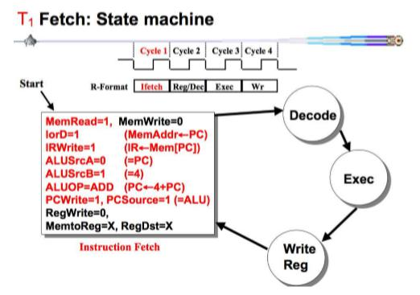
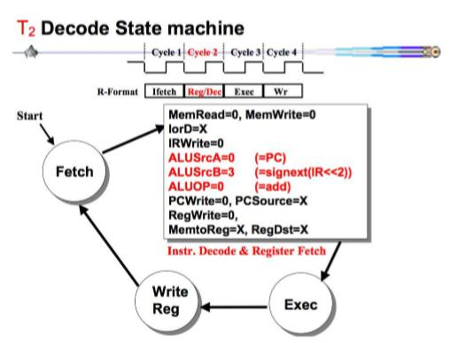
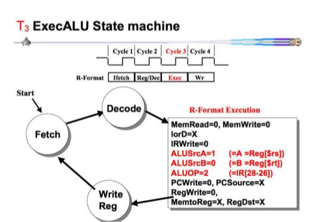
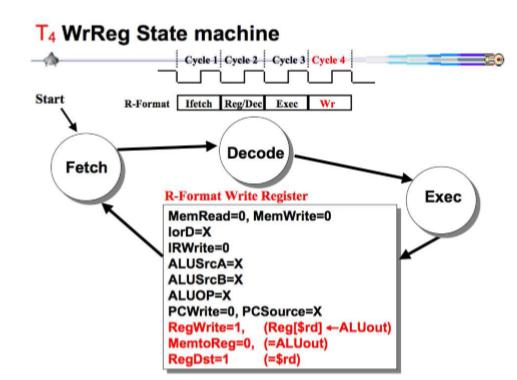
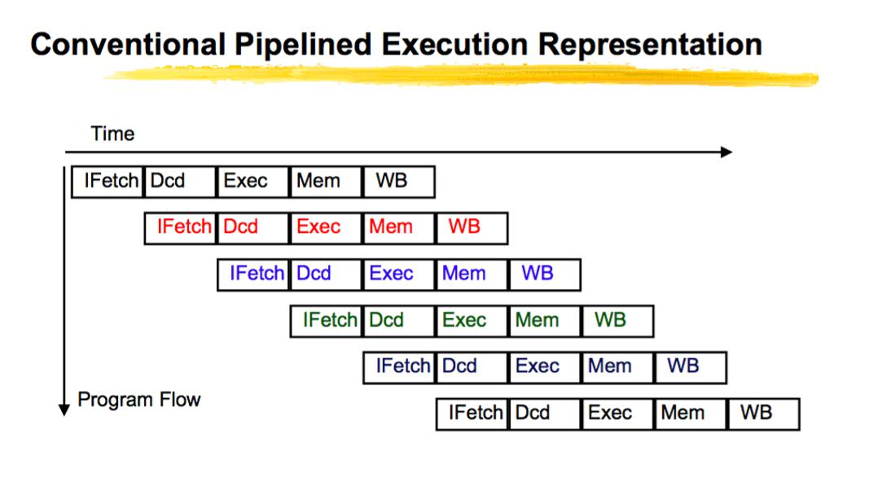

## รายงานวิชา สถาปัตยกรรมคอมพิวเตอร์

### สรุปเนื้อหา
#### MIPS Instruction Format 
*      คำสั่งของ MIPS จะมีทั้งหมด 3 รูปแบบ โดยเเต่ละรูปแบบจะมีขนาด 32 bit ประกอบด้วย R-format , I-format , J-format 

 **R-Format** เป็นชุดคำสั่งที่ไว้ใช้ดำเนินการทางคณิตศาสตร์เช่น การบวก การลบ

|op     |rs     |rt     |rd     |shamt  |func   |
| ----- | ----- | ----- | ----- | ----- | ----- |
|6 bit  |5 bit  |5 bit  |5 bit  |5 bit  |6 bit  |

 **I-Format** เป็นชุดคำสั่งที่ไว้ใช้ดำเนินการเกี่ยวกับการจัดการข้อมูล

|op     |rs     |rt     |offset     |
| ----- | ----- | ----- | -----     | 
|6 bit  |5 bit  |5 bit  |16 bit     |

 **J-Format** เป็นชุดคำสั่งที่ไว้ใช้ดำเนินการ jump ไปทำงานในตำแหน่งอื่นๆ

|op     |address |
| ----- | -----  | 
|6 bit  |26 bit  |

#### การบ้านครั้งที่ 1 [คำสั่ง ADD ใน R-Format]
#### อธิบายการบ้านที่ 1
      โดยคำสั่ง ADD จะมีรูปแบบดังนี้
            ADD $1 ,$2 ,$3
      โดย rd = $1 , rs = $2 , rt = $3
      การทำคำสั่ง ADD นั้นจะนำค่าที่อยู่ใน Register rs มาบวกกับค่าที่อยู่ใน Register rt 
      จากนั้นนำค่าที่ได้มาเก็บไว้ใน Register rd
      
* [คลิปอธิบายการบ้านครั้งที่ 1](https://www.youtube.com/watch?v=xqGYD-_WAHE&t=12s)

#### การบ้านครั้งที่ 2 [การทำงานของ CPU]
##### คำสั่งภาษา JAVA ที่มนุษย์เข้าใจ
      ==== Java Language
      class Test {
         public static void main (String[] args){
            int a = 10;
            int b = 20;
            int c = a + b;
         }
      }
      
##### คำสั่งที่คอมพิวเตอร์เข้าใจ
      ==== Machine Language (in memory)
      00000000:         j 01000000
      00000004:         1A000000          //data
      ...
      01000000:         lw $9, $0(4)
      01000004:         lw $1, $9(0)      //$1 ,a = 10
      01000008:         lw $2, $9(4)      //$2 ,b = 20
      0100000c:         add $3, $1,$2
      01000010:         sw $3, $9(8)
      ...
      A1000000:         0000000A          //a
      A1000004:         00000014          //b
      A1000008:         00000000          //c
      
      
#### อธิบายการบ้านที่ 2
      ในภาษาเครื่อง(Machine Language) จะทำงานตามลำดับของคำสั่งโดยเริ่มต้นเมื่อเปิดเครื่องจะทำงานที่คำสั่ง 
      00000000 j 01000000 ซึ่งคือการ jump ไปที่คำสั่ง 01000000 lw $9, $0(4)
      แล้วทำคำสั่งอื่นตามลำดับต่อไป
      
* [คลิปอธิบายการบ้านครั้งที่ 2](https://www.youtube.com/watch?v=Zj369LrPHwI)

#### การบ้านครั้งที่ 3 [ความเเตกต่างของ Single-Cycle กับ Multi-Cycle]
#### อธิบายการบ้านที่ 3
      ความเเตกต่างของ Single-Cycle และ Multi-Cycle มีดังนี้

##### Single-Cycle

      1. ทุกคำสั่งสามารถทำงานเเละจบได้ภายใน 1 รอบ
      2. มี ALU ภายใน 3 ตัว
      3. มี memory 2 ตัวสำหรับเก็บ Data กับ Instruction

##### Multi-Cycle

      1. ทุกคำสั่งใช้เวลาการทำงานมากกว่า 1 รอบ 
      2. มี ALU ภายใน 1 ตัว
      3. มี memory 1 ตัวเท่านั้นใช้สำหรับเก็บทั้ง Data เเละ Instruction

* [คลิปอธิบายการบ้านครั้งที่ 3](https://www.youtube.com/watch?v=O_0tx7ZDCJY)

#### การบ้านครั้งที่ 4 [คำสั่ง Load word (lw) ใน Multi-Cycle]
#### อธิบายการบ้านที่ 4
      คำสั่ง lw เป็นคำสั่งในรูปแบบ I-Format มีการทำงาน 5 ขั้นตอนดังนี้
            1. (T1) ค่า PC จะถูกเข้าไปเก้บไว้ใน Instruction Register และนำค่า PC มาบวก4 เเล้วเก็บไว้ที่เดิม
            2. (T2) นำ Register ตัวที่ 25 ถึง 21 มาเก็บไว้ใน A และ นำ Register ตัวที่ 20 ถึง 16 มาเก็บไว้ใน B
               จากนั้นนำ Register ตัวที่ 15 ถึง 0 มาผ่าน Sign Extend เพื่อเปลี่ยนจาก 16 bit เป็น 32 bit
               แล้วทำการบวกกับค่า PC ใน ALU
            3. (T3) นำ Register ตัวที่ 15 ถึง 0 มาบวกกับ A ใน ALU จะได้ ALU OUT 
            4. (T4) จะนำค่าที่ได้จาก ALU เข้ามาเก็บไว้ใน Memory Data Register
            5. (T5) ค่าที่ถูกเก็บเข้า Memory Data Register จะถูกส่งต่อไปยัง Register B แล้วนำไปใช้ในคำสั่งต่อๆไป
            
   * [คลิปอธิบายการบ้านครั้งที่ 4](https://www.youtube.com/watch?v=ycMAa37RAyA&t=28s)
   
   
#### การบ้านครั้งที่ 5 [คำสั่ง beq ใน Multi-Cycle]
#### อธิบายการบ้านที่ 5
      คำสั่ง lw เป็นคำสั่งในรูปแบบ I-Format มีการทำงาน 3 ขั้นตอนดังนี้
            1. (T1) ค่า PC จะถูกเข้าไปเก้บไว้ใน Instruction Register และนำค่า PC มาบวก4 เเล้วเก็บไว้ที่เดิม
            2. (T2) นำ Register ตัวที่ 25 ถึง 21 มาเก็บไว้ใน A และ นำ Register ตัวที่ 20 ถึง 16 มาเก็บไว้ใน B
               จากนั้นนำ Register ตัวที่ 15 ถึง 0 มาทำการบวกกับค่า PC ใน ALU
            3. (T3) นำค่า A และ B มาเปรียบเทียบกัน ถ้าเท่ากันจะส่งค่าที่ได้จาก ALU ไปเก็บยัง PC
            
   * [คลิปอธิบายการบ้านครั้งที่  5](https://www.youtube.com/watch?v=xlIhQ_dryE4&t=9s)
   
#### การบ้านครั้งที่ 6 [คำสั่ง R-Type ใน Multi-Cycle]
#### อธิบายการบ้านที่ 6
      คำสั่ง R-Type ใน Multi-Cycle มีการทำงาน 4 ขั้นตอนดังนี้

##### T1

      MemRead=1                     :     เริ่มทำการอ่านข้อมูล     
      lorD=1                        :     นำค่า PC มาเก็บไว้ใน Memory
      IRWrite=1                     :     นำค่า PC ที่เก็บไว้ใน Memory มาใส่ใน Instruction Register
      ALUSrcA=0                     :     นำค่า PC ไปที่ ALU โดยผ่าน MUX 0
      ALUSrcB=1                     :     นำค่า 4  ไปที่ ALU โดยผ่าน MUX 1
      ALUOP=ADD                     :     นำค่า PC และ 4 ที่ ALU มาบวกกัน
      PCWrite=1, PCSource=1         :     นำค่าที่ได้จากการบวกกันไปใส่ใน PC เช่นเดิม

##### T2

      ALUSrcA = 0                   :     นำค่า PC ไปที่ ALU โดยผ่าน MUX ที่ 0 เพื่อเตรียมคำนวน
      ALUSrcB = 3                   :     นำค่า offset มา sign extend จาก 16 bit เป็น 32 bit แล้ว shift left 2 ไปที่ ALU โดยผ่าน MUX
      ALUOP = 0                     :     นำค่า PC มาบวก offset เเต่ R-Type ไม่มี offset จึงข้ามไป

##### T3

      ALUSrcA = 1                   :     นำค่า A ผ่าน MUX ไปที่ ALU 
      ALUSrcB = 0                   :     นำค่า B ผ่าน MUX ไปที่ ALU 
      ALUOP   = 2                   :     นำค่าทั้งสองค่ามาบวกกันแล้วเก็บใน ALUOut

##### T4

      
      RegWrite = 1                  :     นำค่าจาก ALUOut มาเก็บใน Register rd
      MemtoReg = 0                
      RegDst   = 1                  

* [คลิปอธิบายการบ้านครั้งที่  6](https://www.youtube.com/watch?v=jokm1J3zCfc)

#### การบ้านครั้งที่ 7 [Pipeline]
#### อธิบายการบ้านที่ 7
##### Pipeline

    Pipeline เป็นการทำงานของ CPU ที่สามารถทำงานได้เร็วกว่า Single-Cycle กับ Multi-Cycle 
    โดยหลักการการทำงานจะคล้ายกับว่าทำทุกคำสั่งพร้อมกันเเต่จริงไม่พร้อมกัน เเค่คาบเกี่ยวกันในบางคำสั่งเท่านั้น 
    เช่น เมื่อชุดคำสั่งที่ 1 ทำงานคำสั่ง IFetch เสร็จจะไปทำคำสั่ง Dcd ต่อ เเล้วคำสั่ง IFetch จะว่าง
    จึงกระโดดไปทำงานในคำสั่ง IFetch ในชุดคำสั่งที่ 2 ไปพร้อมๆกัน
  
* [คลิปอธิบายการบ้านครั้งที่  7](https://www.youtube.com/watch?v=K0eY3To4GjU)
