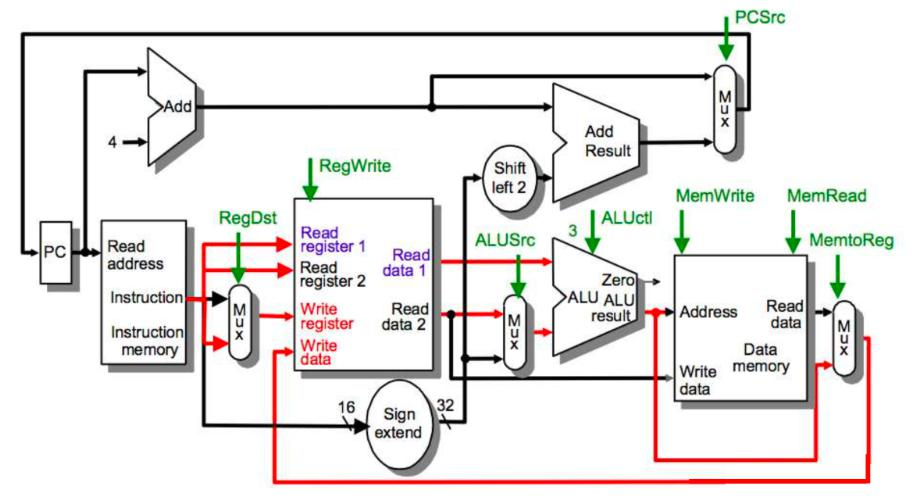
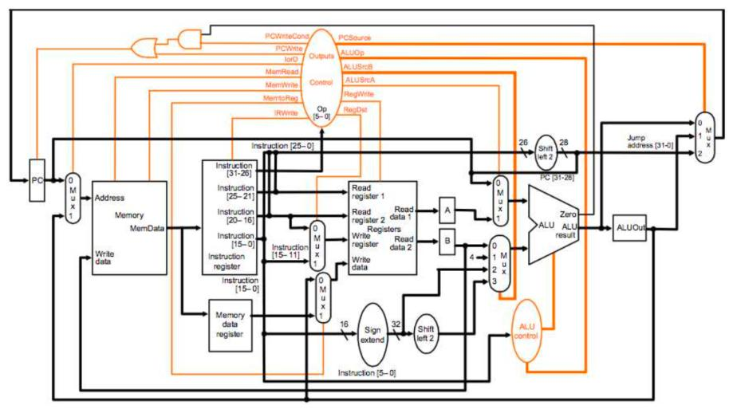

## รายงานวิชา สถาปัตยกรรมคอมพิวเตอร์

### สรุปเนื้อหา
#### MIPS Instruction Format 
*      คำสั่งของ MIPS จะมีทั้งหมด 3 รูปแบบ โดยเเต่ละรูปแบบจะมีขนาด 32 bit ประกอบด้วย R-format , I-format , J-format 

 **R-Format** เป็นชุดคำสั่งที่ไว้ใช้ดำเนินการทางคณิตศาสตร์เช่น การบวก การลบ

|op     |rs     |rt     |rd     |shamt  |func   |
| ----- | ----- | ----- | ----- | ----- | ----- |
|6 bit  |5 bit  |5 bit  |5 bit  |5 bit  |6 bit  |

 **I-Format** เป็นชุดคำสั่งที่ไว้ใช้ดำเนินการเกี่ยวกับการจัดการข้อมูล

|op     |rs     |rt     |offset     |
| ----- | ----- | ----- | -----     | 
|6 bit  |5 bit  |5 bit  |16 bit     |

 **J-Format** เป็นชุดคำสั่งที่ไว้ใช้ดำเนินการ jump ไปทำงานในตำแหน่งอื่นๆ

|op     |address |
| ----- | -----  | 
|6 bit  |26 bit  |

#### การบ้านครั้งที่ 1 [คำสั่ง ADD ใน R-Format]
#### อธิบายการบ้านที่ 1
      โดยคำสั่ง ADD จะมีรูปแบบดังนี้
            ADD $1 ,$2 ,$3
      โดย rd = $1 , rs = $2 , rt = $3
      การทำคำสั่ง ADD นั้นจะนำค่าที่อยู่ใน Register rs มาบวกกับค่าที่อยู่ใน Register rt 
      จากนั้นนำค่าที่ได้มาเก็บไว้ใน Register rd
      
* [คลิปอธิบายการบ้านครั้งที่ 1](https://www.youtube.com/watch?v=xqGYD-_WAHE&t=12s)

#### การบ้านครั้งที่ 2 [การทำงานของ CPU]
##### คำสั่งภาษา JAVA ที่มนุษย์เข้าใจ
      ==== Java Language
      class Test {
         public static void main (String[] args){
            int a = 10;
            int b = 20;
            int c = a + b;
         }
      }
      
##### คำสั่งที่คอมพิวเตอร์เข้าใจ
      ==== Machine Language (in memory)
      00000000:         j 01000000
      00000004:         1A000000          //data
      ...
      01000000:         lw $9, $0(4)
      01000004:         lw $1, $9(0)      //$1 ,a = 10
      01000008:         lw $2, $9(4)      //$2 ,b = 20
      0100000c:         add $3, $1,$2
      01000010:         sw $3, $9(8)
      ...
      A1000000:         0000000A          //a
      A1000004:         00000014          //b
      A1000008:         00000000          //c
      
      
#### อธิบายการบ้านที่ 2
      ในภาษาเครื่อง(Machine Language) จะทำงานตามลำดับของคำสั่งโดยเริ่มต้นเมื่อเปิดเครื่องจะทำงานที่คำสั่ง 
      00000000 j 01000000 ซึ่งคือการ jump ไปที่คำสั่ง 01000000 lw $9, $0(4)
      แล้วทำคำสั่งอื่นตามลำดับต่อไป
      
* [คลิปอธิบายการบ้านครั้งที่ 2](https://www.youtube.com/watch?v=xqGYD-_WAHE&t=12s)

#### การบ้านครั้งที่ 3 [ความเเตกต่างของ Single-Cycle กับ Multi-Cycle]
#### อธิบายการบ้านที่ 3
      ความเเตกต่างของ Single-Cycle และ Multi-Cycle มีดังนี้

##### Single-Cycle

      1. ทุกคำสั่งสามารถทำงานเเละจบได้ภายใน 1 รอบ
      2. มี ALU ภายใน 3 ตัว
      3. มี Mux 4 ตัว
      4. มี memory 2 ตัวสำหรับเก็บ Data กับ Instruction

##### Multi-Cycle

      
